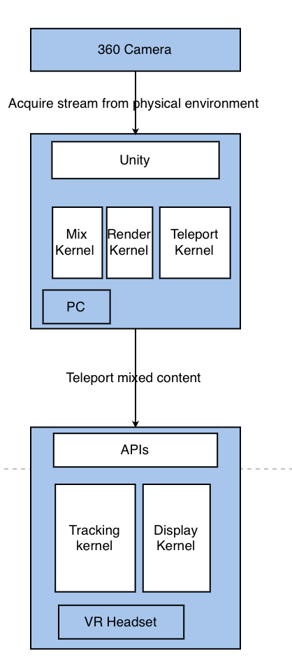

# Teleportation into Mixed Reality World

# Team Members

**Yixiang Zhang**
* responsible for fusing virtual content with the stream captured by 360 camera
    
**Zhaolong Wei**
* responsible for capture video stream from the physical environment by using 360 camera and teleport the captured stream to computer in order to mix with virtual content 

**Chia Li**
* responsible for teleporting the mixed stream to VR headset and achieve tracking by using APIs provided by VR headset

**Jianyun Miao**
* responsible for testing every phase and writing the reports and potentially need to render vitual content
  
# Background
Mixed Reality systems can teleport a participant to a remote physical location
enhanced with virtual overlays to provide spatial context. The goal is to enhance content sharing
and ease collaboration. To enable this, 360 cameras capture the physical environment and overlay
virtual content on the captured video stream. The high fidelity 360-video provides better
collaboration and a high sense of telepresence compared to traditional display systems. View
independence between the local and remote user improves the speed of collaboration. 360-video
only teleports physical setup and co-located users to remote users. The goal is to overlay virtual
objects precisely on the 360-videos, and track those overlays as the scene changes.

# Goal
Stream the panoramic view of a physical space from one 360-camera to a VR headset. Also
overlay virtual objects on the camera stream.

# Deliverables
We are going to create an empty room and add virtual furniture in this room

# Block Diagram

# Potential Challenges
One of the biggest challenge that we may face would be how to mix the virtual content with the stream captured by the 360 camera. Unity may be used for mixing and rendering virtual content. In that case, we need to get familiar with Unity and how to render a virtual content.

Another challenge that we may face would be how to capture the stream from pyhsical environment by using 360 camera and how to teleport the stream to computer and make sure that stream can be edited.

Tracking would also be potential challenge. From our understanding, the interfaces between trackers and headset are provided by headset manufactury. So that we have to familiar with the headset APIs.

# Project Timeline
We divide the whole development process into four phases as following:
  * **2/10 - 22/10**: Realize the ability to acquire streams from 360 cameras and transfer them to a computer
  * **22/10 - 5/11**: Enable the ability to mix virtual content with the streams. Before that, we need to render the virtual content first.
  * **5/11 - 19/11**: Teleporting the mixed stream to VR headset and enable tracking.
  * **19/11 - 3/12**: Testing all functions and praparing the report.

# References
* Augmented Virtual Teleportation for High-Fidelity Telecollaboration
* Exploring interaction techniques for 360 panoramas inside a 3D reconstructed scene for mixed
reality remote collaboration
* SCeVE: A Component-based Framework to Author Mixed Reality Tours

##### **Things may vary due to different factors**